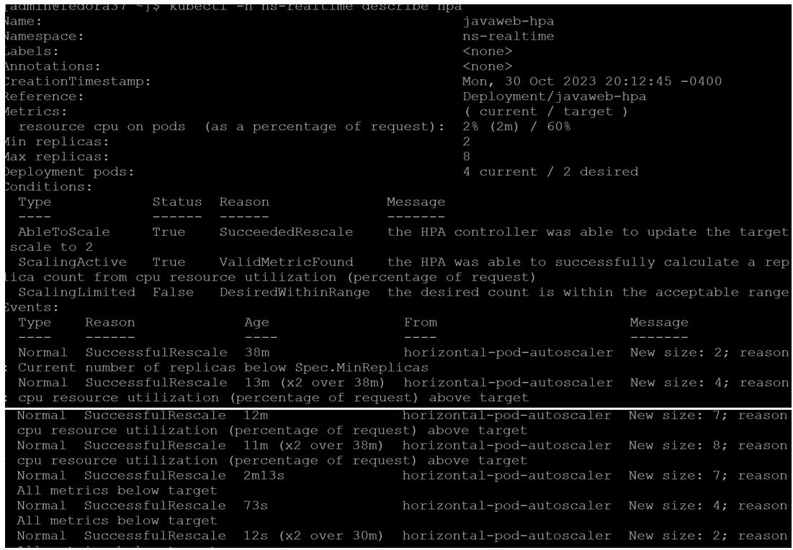

# kubernetes-hpa-loadtest
Kubernetes Horizontal Pod Autoscaling(HPA)  Load Test

-  Prereq: Java 18 or higher, IntelliJ/Eclipse
-  Spring Reactive WebClient - K8sLoadTestClient.java
     - 20 Threads in Thread pool 
     - 100K Iterations
-  Screen shot of the pods scale and shrink automatic

   
